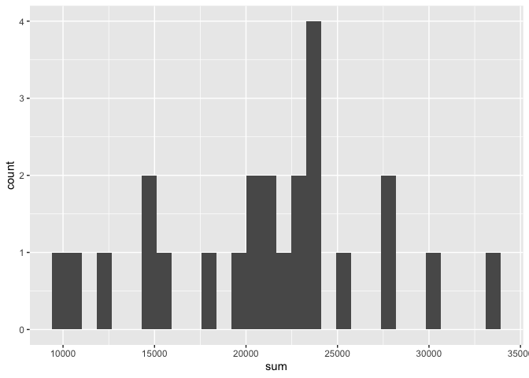
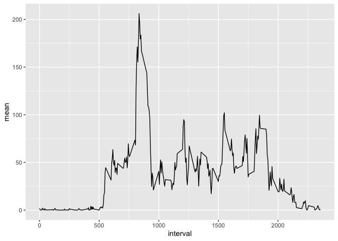
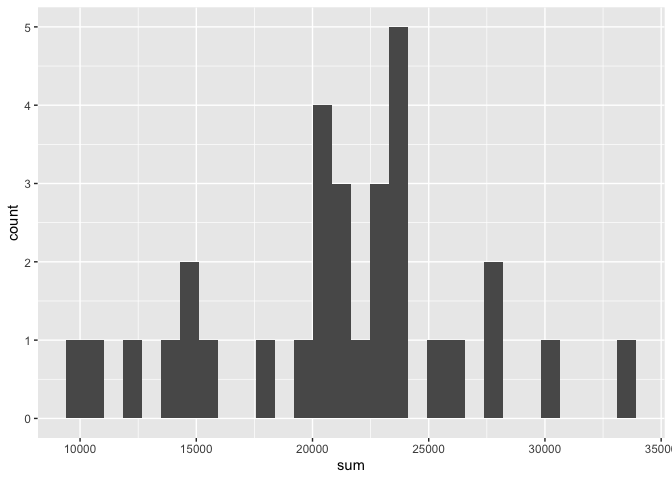
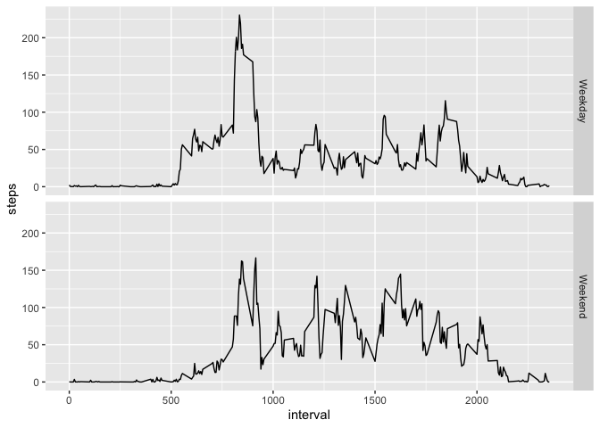

```r
library(knitr)
opts_chunk$set(message = FALSE)
options(scipen=999)
```

```r
library(tidyverse)
library(lubridate)
```
## Loading and preprocessing the data

Read the data:


```r
dat <- read_csv("./data/activity.csv")
```

## What is mean total number of steps taken per day?

Calculate the daily sum of steps:


```r
dat_daily <- dat %>% 
  group_by(day(date)) %>% 
  summarise(sum = sum(steps))
```

Plot a histogram:


```r
dat_daily %>% 
  ggplot(aes(sum)) + geom_histogram()
```

```
## Warning: Removed 7 rows containing non-finite values (stat_bin).
```

<!-- -->

Calculate the mean:


```r
dat_daily %>% 
  summarise(mean = mean(sum, na.rm = TRUE))
```

```
## # A tibble: 1 x 1
##     mean
##    <dbl>
## 1 21152.
```

Calculate the median:


```r
dat_daily %>% 
  summarise(median = median(sum, na.rm = TRUE))
```

```
## # A tibble: 1 x 1
##   median
##    <dbl>
## 1  21782
```

## What is the average daily activity pattern?

Calculate the mean number of steps per interval:


```r
dat_intervalmean <- dat %>% 
  group_by(interval) %>% 
  summarise(mean = mean(steps, na.rm = T))
```

Make a time series plot:


```r
dat_intervalmean %>% 
  ggplot(aes(interval, mean)) + geom_line() 
```

<!-- -->

Identify which 5-minute interval contains max number of steps:


```r
which.max(dat_intervalmean$mean)
```

```
## [1] 104
```

```r
dat_intervalmean$interval[104]
```

```
## [1] 835
```

## Imputing missing values:

Total number of missing values:


```r
sum(!complete.cases(dat))
```

```
## [1] 2304
```

Impute missing data using the mean of the 5 minute interval:


```r
dat_imputed <- left_join(dat, dat_intervalmean)

dat_imputed <- dat_imputed %>% 
  mutate(steps = ifelse(is.na(steps),mean,steps))
```

Histogram of total number of steps each day using imputed data:


```r
dat_imputed %>% 
  group_by(day(date)) %>% 
  summarize(sum = sum(steps)) %>% 
  ggplot(aes(sum)) + geom_histogram()
```

<!-- -->

Calculate the mean:


```r
dat_imputed %>% 
  group_by(day(date)) %>% 
  summarise(sum = sum(steps)) %>% 
  summarise(mean = mean(sum))
```

```
## # A tibble: 1 x 1
##     mean
##    <dbl>
## 1 21185.
```

Calculate the median:


```r
dat_imputed %>% 
  group_by(day(date)) %>% 
  summarise(sum = sum(steps)) %>% 
  summarise(median = median(sum))
```

```
## # A tibble: 1 x 1
##   median
##    <dbl>
## 1  21641
```

The mean without imputation was 21152 and the mean **with** imputation 21185.  
The median without imputation was 21782 and the median **with** imputation was 21641. Imputation did not make a big impact on the estimates of the total daily number of steps.

## Are there differences in activity patterns between weekdays and weekends?

Create a new factor variable with the labels "weekday" or "weekend":


```r
dat_imputed <- dat_imputed %>% 
  mutate(day_of_week = wday(date, label = TRUE)) %>% 
  mutate(day_of_week = ifelse(day_of_week == "Sat" | day_of_week == "Sun","Weekend","Weekday"))

dat_imputed <- dat_imputed %>% 
  mutate(day_of_week = as_factor(day_of_week))
```

Average across intervals for each level of day_of_week:

```r
day_interval <- dat_imputed %>% 
  group_by(day_of_week, interval) %>% 
  summarise(mean_per_interval = mean(steps))
```
Plot time series according to weekend/weekday:

```r
day_interval %>% 
  ggplot(aes(interval, mean_per_interval)) + geom_line() + 
  facet_grid(day_of_week ~ .) + ylab("steps")
```

<!-- -->
